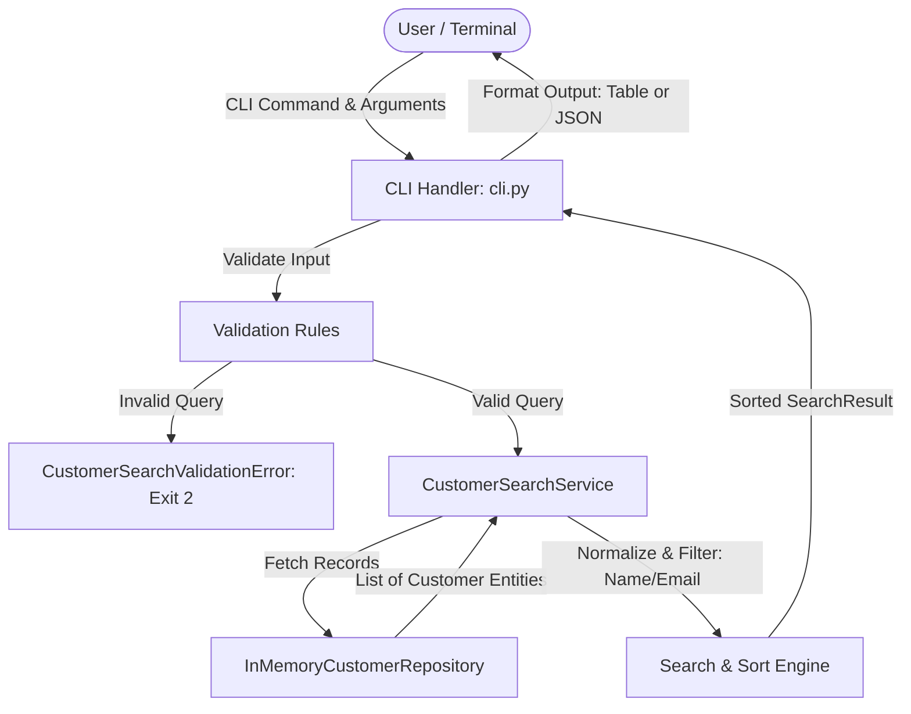

# Architecture

## Overview

The Customer Search feature is designed following layered and clean architecture principles. It separates the presentation layer (CLI), application/service layer (search engine and business rules), domain model layer (entities and value objects), and data access layer (repository pattern). This structure guarantees high cohesion, low coupling, testability, and zero runtime dependencies outside the Python standard library.

## Components

1. **Domain Model (`customer_search.models`)**:
   - `Customer`: Represents a customer entity with immutable attributes (`id`, `name`, `email`, `phone`, `is_active`).
   - `SearchResult`: Encapsulates search results, count, query metadata, and execution time.

2. **Exceptions (`customer_search.exceptions`)**:
   - `CustomerSearchException`: Base exception class.
   - `CustomerSearchValidationError`: Triggered when input fails validation rules (empty query, too short).
   - `CustomerDataError`: Triggered when data files are corrupted or missing.

3. **Data Access Layer (`customer_search.repository`)**:
   - `CustomerRepository` (Protocol): Abstract interface defining read operations for customer records.
   - `InMemoryCustomerRepository`: Implements customer retrieval from in-memory collections and optional JSON files.

4. **Service Layer (`customer_search.service`)**:
   - `CustomerSearchService`: Coordinates search execution, query validation, Unicode normalization (case and diacritics), filtering, and sorting.

5. **Presentation Layer (`customer_search.cli`)**:
   - `main()` and CLI parser: Implements command-line arguments parsing, invokes search service, formats outputs (table or JSON), and controls process exit codes.

## Responsibilities

| Component | Primary Responsibility |
| :--- | :--- |
| `Customer` | Encapsulates customer state and data integrity |
| `CustomerSearchService` | Applies validation, normalization, search filters, and sorting |
| `CustomerRepository` | Provides storage abstraction and retrieval of customer records |
| `cli.py` | Handles CLI arguments, flags, output rendering, and exit status |
| `exceptions.py` | Encapsulates specific domain and validation errors |

## Data Flow



## Interfaces

```python
class CustomerRepository(Protocol):
    def get_all(self) -> list[Customer]:
        """Retrieve all customers."""
        ...

class CustomerSearchService:
    def __init__(self, repository: CustomerRepository):
        ...

    def search(
        self,
        query: str | None = None,
        name: str | None = None,
        email: str | None = None
    ) -> SearchResult:
        """Executes search with validation, normalization, and ordering."""
        ...
```

## Error Handling

- **Validation Errors (`CustomerSearchValidationError`)**: Caught at the CLI boundary, displays user-friendly error message on `stderr`, exits with code `2`.
- **Data Load Errors (`CustomerDataError`)**: Caught at the CLI boundary, displays error message on `stderr`, exits with code `1`.
- **Zero Matches**: Handled as a normal business outcome, displays message indicating 0 matches found, exits with code `0`.

## Testing Strategy

- **Unit Tests**:
  - `tests/test_models.py`: Verify model creation, immutability, and serialization.
  - `tests/test_validation.py`: Test all boundary conditions for search queries (empty, spaces, <2 chars).
- **Service Tests**:
  - `tests/test_service.py`: Verify case-insensitivity, diacritic stripping, partial matches, sorting, and unified query behavior.
- **Repository Tests**:
  - `tests/test_repository.py`: Test in-memory storage and JSON file loading.
- **Integration & CLI Tests**:
  - `tests/test_cli.py`: Test CLI argument handling, exit codes, tabular output, and `--json` flag.
- **Performance Benchmark**:
  - `tests/test_performance.py`: Measure execution time for 10,000 in-memory records (must be < 100ms).

## Dependencies

- **Runtime**: None (Pure Python 3.11+ Standard Library: `dataclasses`, `argparse`, `unicodedata`, `json`, `pathlib`, `time`, `typing`).
- **Development & Testing**: `pytest` >= 8.0.

## Design Decisions

1. **Protocol-based Repository**: Allows decoupling search logic from storage, making testing effortless with mock or in-memory fixtures.
2. **NFKD Diacritic Normalization**: Converts characters like "é" to "e" during matching, meeting internationalization and user experience needs without altering output data.
3. **Argparse CLI**: Built-in, robust CLI parsing without pulling external packages like `click` or `typer`.
4. **Clean Exit Code Convention**: 0 for success, 2 for CLI/argument validation errors, 1 for unexpected errors.

## Trade-offs

- **Linear Scan vs. Inverted Index**: For datasets under 50,000 records, in-memory linear scan with pre-normalized or on-the-fly string comparison executes in ~5-15ms, avoiding the memory overhead, indexing complexity, and synchronization issues of an inverted index.
- **CLI vs. HTTP Web Server**: A CLI requires zero server setup, runs instantly in any environment, and satisfies all ADA-05 requirements directly.
